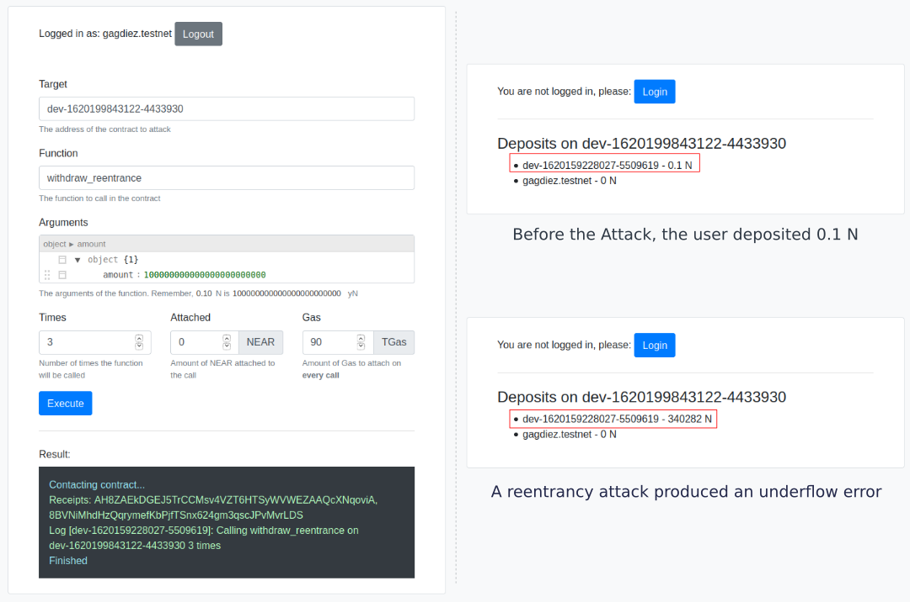

# Reentrancy Attacks

This repository shows how to perform a reentrancy attack on a smart contract, as well as how to protect a contract from such attack. The repo is composed by two components:
1. A simple contract which allows to deposit and withdraw NEARs.
2. A contract that can perform a reentrancy attack in any (unprotected) contract.

## The Exploitable Contract

The Exploitable Contract (EC) is a contract that implements 3 methods:
- Deposit: Method that allows to deposit money
- Withdraw: Method that allows to withdraw the deposited money
- Withdraw Reentrancy: An exploitable version of the method "withdraw".

## Reentrancy Attack Contract

The Reentrancy Attack Contract (RAC) implements a single method. Given a 
contract address (TARGET), a function (fc), its arguments (args), and a
number N, our contract will call Target.fc(args) N times in a row to try
to exploit it.

I have built a user friendly UI to interact with the contract.

# Performing a Reentrancy Attack in the Explitable Contract

## Starting the contracts

Enter in the folders and run
> npm install
> npm start

This will open two browser tabs: One to interact with the Exploitable Contract (EC),
and the other to interact with the Reentrancy Attrack Contract (RAC).

## Reentrancy Attack

Copy the EC address into the "Target" field of the RAC. Call first the function
"deposit" with 0.01N attached to deposit them in the EC. Then, call "withdraw"
with the parameters {"amount": "10000000000000000"} 3 times, it should fail.
Try again but calling "withdraw\_reentrance" this time. Congratulations, you
just performed a reentrancy attack.

